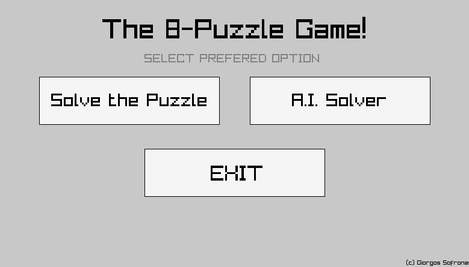

# 8-Puzzle Game!

### Try the Game (Online): [gsofron.itch.io/8-puzzle-game](https://gsofron.itch.io/8-puzzle-game)

  
  

### How to Play

* Select a mode (using the mouse): either solve the puzzle yourself, or let the computer do it in the minumum number of moves.
* Give the initial puzzle state. Press number-keys 1-8 on your keyboard and the SPACE bar for the blank tile. The puzzle is filled row-by-row from left to right.
* If you select the **manual mode**, using the arrow keys, you should try to solve the puzzle. The goal is to reach the goal-state showed on the screen. *Example:* Pressing the UP arrow key, will move the tile below the blank one, upwards.
* If you select the **A.I. mode**, press ENTER to generate each optimal move, until the puzzle is solved.
* In case of an unsolvable initial puzzle, the game terminates.

### Backstory

This project was developed as part of a bonus question for the first assignment of the course "Data Structures and Programming Techniques" (course professor: Manolis Koubarakis).

Spring semester 2022 - 2nd semester of my undergraduate studies.

The game was published on **ithc.io** on *July 11th 2022* (right after the semester ended).
