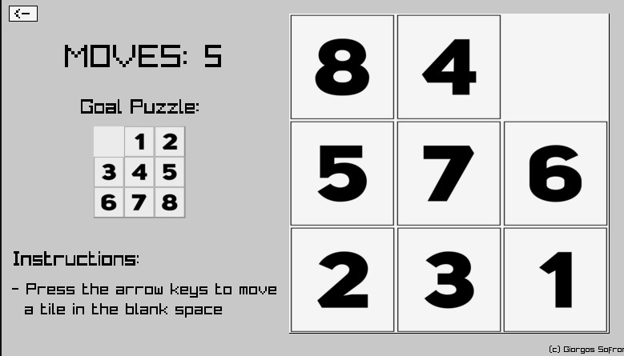

# 8-Puzzle Game!

### Try the Game (Online)

**The game is available here: [gsofron.itch.io/8-puzzle-game](https://gsofron.itch.io/8-puzzle-game)** (instructions are provided). 

  
  

### Backstory

This project was developed as part of a bonus question for the first assignment of the course "Data Structures and Programming Techniques" (course professor: Manolis Koubarakis).

Spring semester 2022 - 2nd semester of my undergraduate studies.

The game was published on **ithc.io** on *July 11th 2022* (right after the semester ended).